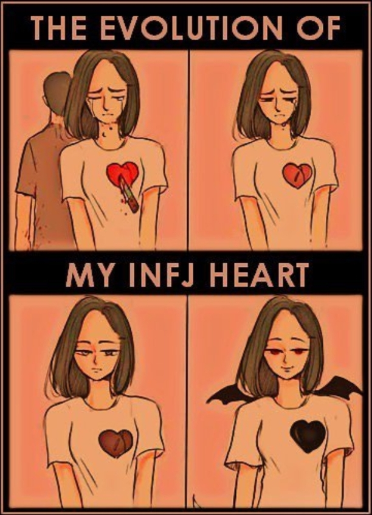

_[someone hurts INFJ, again]_
 
 

_(inside the brain van, Fi is coming forward approaching Fe but then surprised)_
 

**Fi:** "Hey! look at this beauti- wait, Fe. Why are you bleeding again? now which asshole made you like this?!"

**Fe:** "No, this is fine. It hurts but I'm used to it now"

**Fi:** "Yeah and you think I'm stupid? YOU'RE DEFINITELY NOT FINE. You're not yet fully recovered from the previous time and now the hole in you is getting bigger and bigger as if it'll devour your soul anytime soon!"

 
_(Ni is turning back from the driver seat)_
 

**Ni:** "So this is it... I'm wondering, just how stupid can you be, Fe?"

**Fi:** "I agree she's stupid, but Fe is dying and your words are just so mean, Ni"

**Ni:** "No, but look at someone who's probably not even aware of what just they did, ha ha"

**Fi:** "Sorry, Fe, I didn't mean to..."

**Fe:** "No problem, Fi, but please don't make me feel more stupid than this. Ni is right, He told me about this over and over again but I haven't learned my lesson"

**Fi:** "I mean... it's just- anyway you gotta immediately handle your wounds"

**Fe:** "I can handle this myself, thanks. I think this is going to be _daijoubu, dayo!_"

**Ni:** "Cih, stop it hey, everyone knows you're just acting strong. This time you reached your limit. I'm gonna escort you to the healing room, Fe"

**Fe:** "* _Hiks.. hiks_ * I don't know, you guys right. Help me * _hiks_ *"

 
_(one seat in the back, Ti puts his headphone off)_
 

**Ti:** "SHIT! The heck? I slipped and just blundered my queen because of your nonsense conversation guys"

**Fi:** "Wait Ti, why are you playing chess?"

**Ti:** "Oh, Fe told me to do it to distract this person's attention"

**Ni:** "Oh, Fe is going to the healing room right now"

**Fe:** "Hey Ti, I hope you can help Ni if he needed any direction while I'm gone"

**Ti:** "Oh, okay"

**Se:** "_(yell at the back seat)_ I CAN HEAR YOU GUYS. ACTUALLY, I'D ALSO LIKE TO HELP NI GIVE HIM 'DIRECTION' I'M GOOD AT THAT THO! HAHA..."

**Ni:** "Well, please no. Last time was a mess and it also gives a lot of side effects to Fe when you were carelessly driving us so crazy..."

**Ti:** "Actually, I kinda like that. But for Fe's sake you better not this time"

**Se:** "HEH YOU GUYS SO DULL. HAHAHAH!"

 
_a few days later..._
 

_(Fi opens healing room's door)_
 

**Fi:** "Hey, how are you feeling?"

**Fe:** "Better, but I guess I still need some time"

**Fi:** "Okay, glad to hear that"

 
_later..._
 

_(Fi is checking Fe again)_
 

**Fi:** "Hey, how are you..."

**Fe:** "Just leave me alone"

**Fi:** "* _gasp_ * ..okay, Fe, hope you well soon"

 
_Fi then reports Fe's weird behaviour to Ni and Ti_
 

**Ni:** "I've got a bad feeling about this"

**Ti:** "Should we check her condition? I'm curious what's exactly happening with Fe"

**Ni:** "I don't know but it's better not to"

**Ti:** "Why?"

**Ni:** "Don't ask me why."

**Ti:** "'kay."

 
_later the day Fe comes out from the healing room. There are Ni, Ti, and Fi together_
 

**Fe:** "Hi everyone, how's it going?"

**Ni:** "Hey welcome back Fe- * _gasp_ * ...so, apparently this is my bad feeling is all about"

**Ni:** "What the heck is happened to you?"

**Ti:** "Wow! you turned dark, cool. How did you get that tan? What chemical reaction you used?"

**Fi:** "Are you alright, Fe?"

**Fe:** "I'm good. Though I feel much much better now. I feel like nothing can stand in my way"

**Ni:** "Umm... I'm not feeling good about this, but if you say so then it'll be it. Lets get to work again"

**Fe:** "LETS FUCKING GOOOOOOO..."

**Fi:** "Wait what-"

**Fi:** "_Kanbenshitekure..._"

**Ti:** "Wut the heck? hahahah"

**Se:** "OH YEAH... LETS GO BITCH! WOOO"

